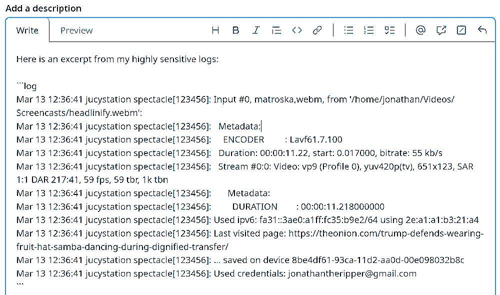

# Scripts - Random Collection of Useful Scripts

### `anonymize`
Anonymizes a text by replacing words with predefined placeholders.

#### anonymize-paste

Uses `anonymize` on the content of the clipboard and pastes it to the currently focused window.



### `fix_broken_symlinks`
Interactively repair broken symlinks using plocate.

```bash
Broken: /home/john/.local/bin/headlinify -> /home/john/some/path/headlinify.py
1) /home/john/some/other/path/headlinify.py
0) Skip
Choose a line number: 1
```

### `genpw`
Generate passwords and usernames from /dev/urandom using 'a-zA-Z0-9-!@#$%^&*()_+~'

```bash
$ genpw 40
L&bGI~96*dx%YbloSWu6%&iLc!r3VHCcyF!%3N4u

$ genpw 10x2 username
Iougleicke
Vaaaaalues
```

### `headlinify`
Apply headline/title-case capitalization to text.

```bash
> ./headlinify "the man with the golden gun"
The man With the Golden Gun
```

#### headlinify-highlight

Uses `headlinify` on the current selection.


### `paste`
A script that pastes text in the currently focussed window.
It is meant to be used by other programs.
It determines the currently focused window and "presses" <kbd>Ctrl</kbd> + <kbd>Shift</kbd> + <kbd>V</kbd> if it's a terminal or <kbd>Ctrl</kbd> + <kbd>V</kbd> otherwise.
It expects the text as an argument: `./paste.bash "Hello World!"`

### `pdfreplace`
Find and replace multiple strings in a PDF while trying to preserve the appearance.

### `strconv`
strconv converts a string with spaces and non-ascii into spaceless-ascii.
It is intended to sanitize directory names.

```bash
$ strconv Die Lösung des Problöms ißt Gemüse
Die_Loesung_des_Probloems_isst_Gemuese

$ echo 'Die Lösung des Problöms ißt Gemüse' | strconv
Die_Loesung_des_Probloems_isst_Gemuese
```

---

## Legacy Archive

### `arXiv`
Fetch latest papers from arxiv.org

### `telegram-send`

Sends a file or a message string to a preconfigured Telegram bot.

```bash
telegram-send <file>/This is a long message
```
If the message consists of just one word or path and this word/path refers to an existing file, then a file is send.
Otherwise a message.
